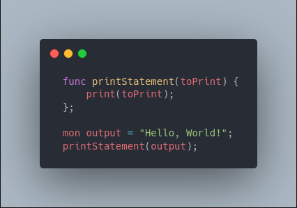

<br />
<p align="center">
  <a href="https://github.com/veasman/Monke">
    
  </a>

  <h3 align="center">Monke</h3>

  <p align="center">
    Yet another Programming Language
    <br />
    <a href="https://monke.readthedocs.io"><strong>« Explore the docs »</strong></a>
  </p>

</p>

## Installation
```bash
git clone https://github.com/veasman/Monke.git
cd Monke
sudo make install
```

## Usage
- File must end in ".monke"
```bash
monke <FILE HERE>
```

## FAQ

### What is Monke?
Monke is a programming language I made because I had nothing better to do, and it was a learning experience.

### What is it for?
Programming simple and a little more advanced programs.
